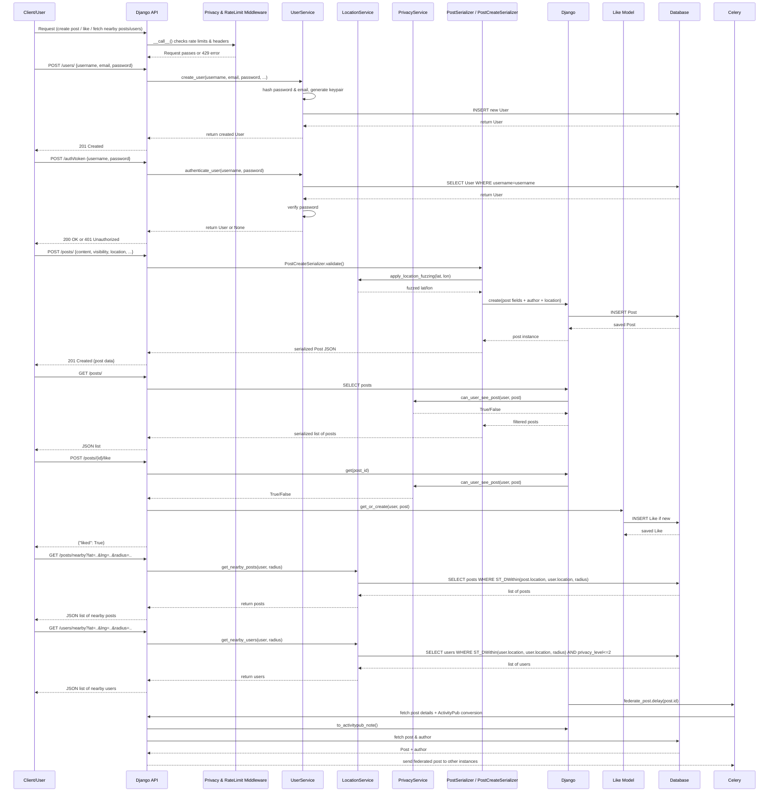

```bash

# Clone repository
git clone https://github.com/B1naryB0t/Glade

# Make script executable
chmod +x scripts/quick-setup.sh

# Run setup
./scripts/quick-setup.sh

# Add demo data
cd infrastructure/docker
docker-compose exec backend python /app/scripts/demo-data.py
```

